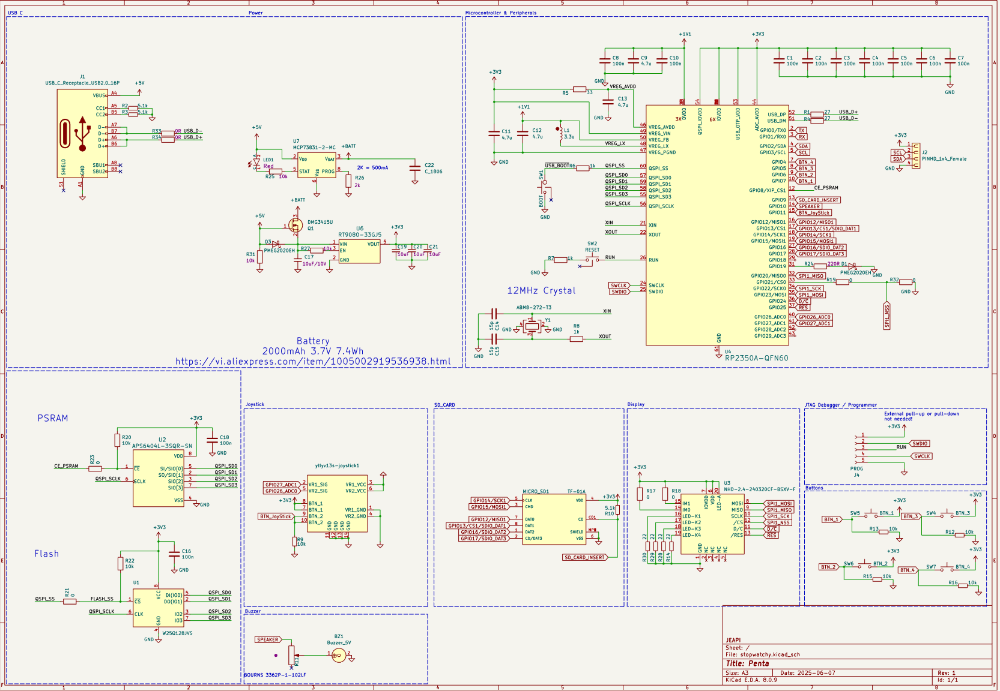
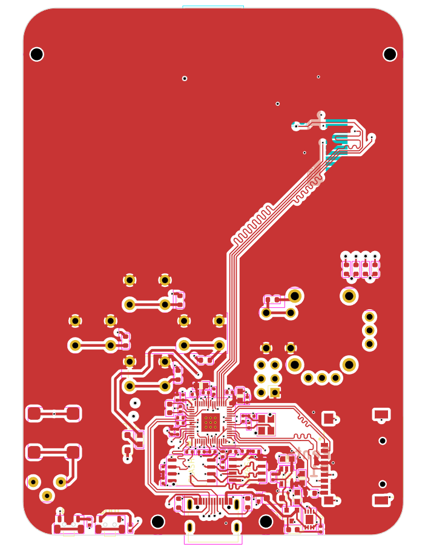
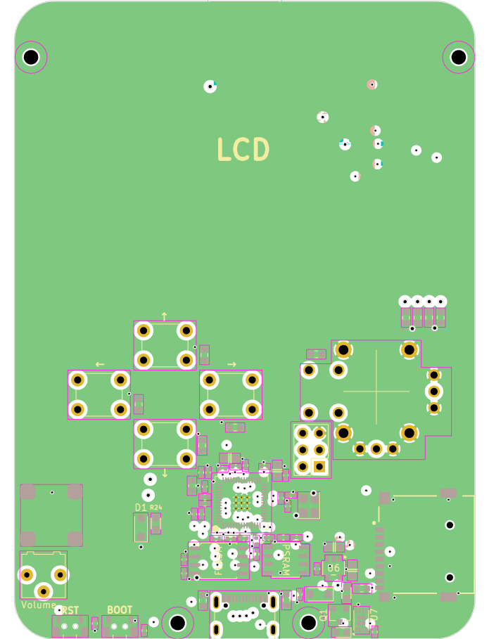
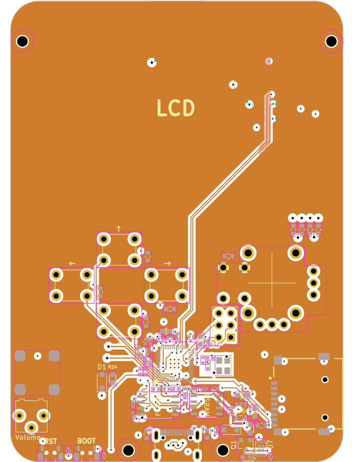
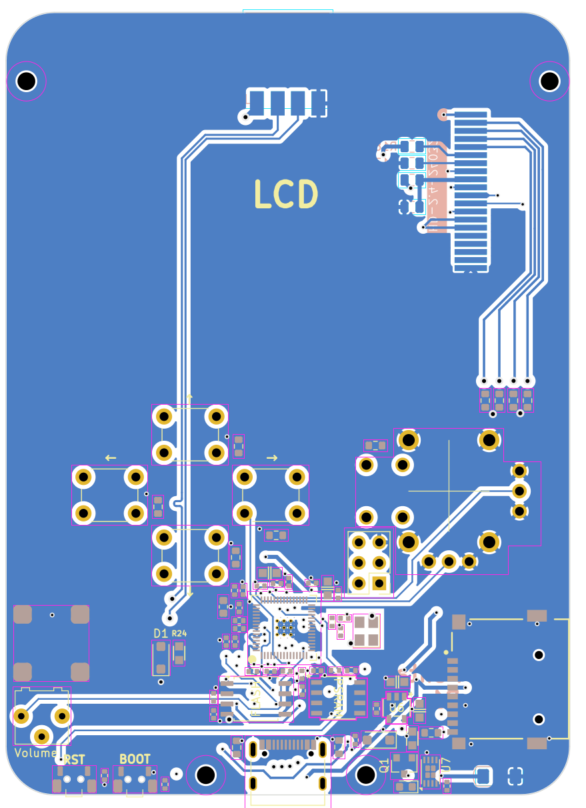

## Schematic and PCB Layers

- [Schematic](schematic.pdf)
- [PCB Front](pcbF.pdf)
- [PCB Back](pcbB.pdf)
- [PCB Inner Layer 1](pcbIn1.pdf)
- [PCB Inner Layer 2](pcbIn2.pdf)

## Here As Image Previews.

### Schematic 

### PCB Front

### PCB Inner Layer 1

### PCB Inner Layer 2

### PCB Back

